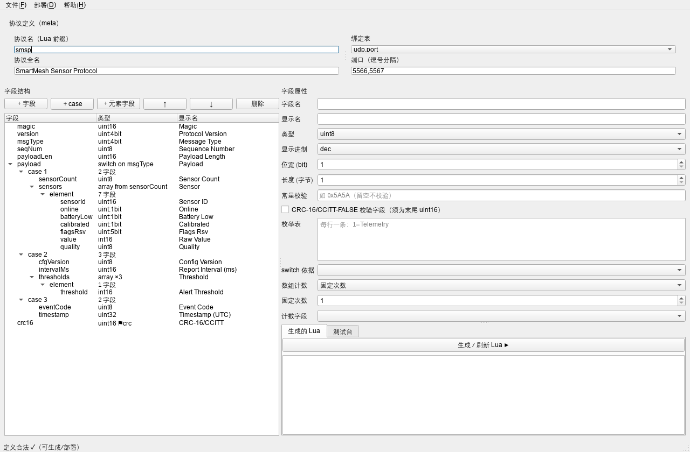
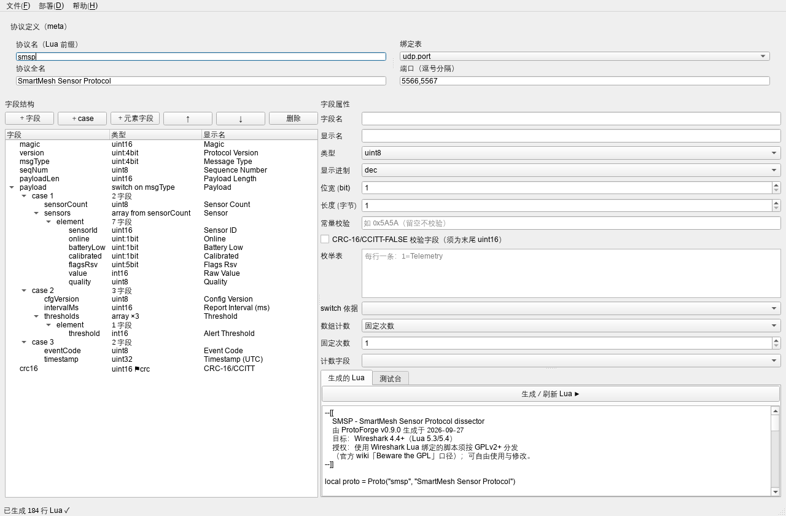
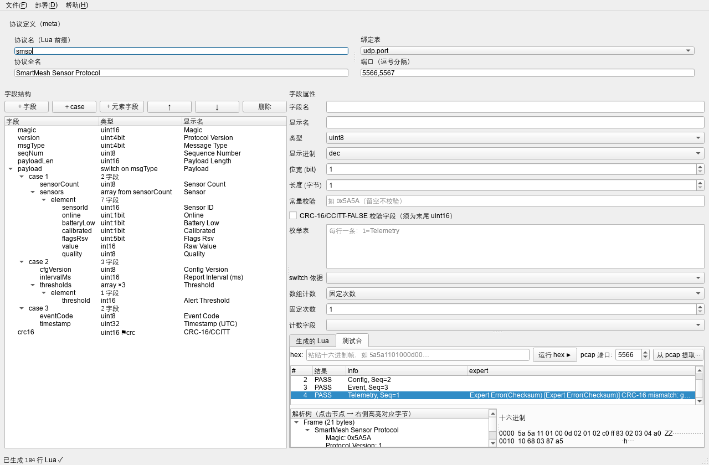
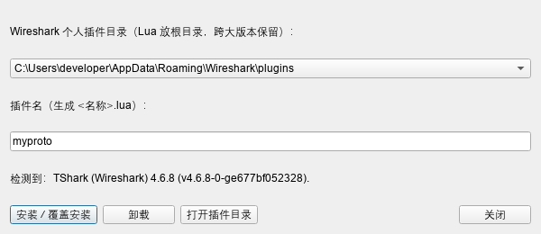

# ProtoForge 使用手册

> 版本 v0.9.0 ｜ 2026-09-27 ｜ 适用于 Windows（Linux/macOS 同理）
> ProtoForge 是一个 Wireshark Lua 解析器（dissector）生成器：声明式定义私有二进制协议，
> 一键生成完整 Lua 解析器、一键部署进 Wireshark、内置测试台免抓包验证。

---

## 目录

1. [产品简介与工作原理](#1-产品简介与工作原理)
2. [安装与启动](#2-安装与启动)
3. [五分钟快速上手](#3-五分钟快速上手)
4. [界面详解](#4-界面详解)
5. [协议定义详解（类型系统）](#5-协议定义详解类型系统)
6. [JSON 格式参考](#6-json-格式参考)
7. [CSV 格式参考](#7-csv-格式参考)
8. [测试台使用指南](#8-测试台使用指南)
9. [命令行（CLI）参考](#9-命令行cli参考)
10. [部署与 Wireshark 版本兼容](#10-部署与-wireshark-版本兼容)
11. [故障排查 FAQ](#11-故障排查-faq)
12. [授权与合规](#12-授权与合规)
13. [路线图与已知限制](#13-路线图与已知限制)

---

## 1. 产品简介与工作原理

### 1.1 解决什么问题

任何跟私有二进制协议打交道的工程师（IoT、车载、工业、电信）都逃不过一件事：
让 Wireshark 能看懂自己的协议。官方路径只有一条——手写 Lua dissector。
这是公认的枯燥苦活：样板代码多、位域掩码易错、注册机制难懂、调试靠猜、
API 版本坑多（典型如 `ByteArray:get()` 在 4.6 里根本不存在，要用 `get_index()`）。

ProtoForge 把这件事变成「填表格」：

```
协议定义（GUI 表格 / JSON / CSV）
        │  model.validate（校验：位域边界、引用、CRC 位置…）
        ▼
generator（生成器：位域掩码、switch 分支、数组循环、CRC 计算、expert 挂载、端口注册）
        ▼
完整 Lua dissector（.lua 文件，约为你手写量的 3 倍行数，但每行都对）
        ├──▶ 测试台：内置 mock 引擎真实执行 Lua，免抓包看解析树
        └──▶ 一键部署：写入 Wireshark 个人插件目录，重启即生效
```

### 1.2 生成器替你挡掉的坑（实测验证）

以下坑全部来自开发期真实踩坑记录，生成器已内置规避：

| 坑 | 说明 |
|---|---|
| `ByteArray:get()` 不存在 | Wireshark 4.6 的正确 API 是 `get_index()`；生成器统一使用后者 |
| 数值字段不能传字符串值 | `tree:add(pf, range, "文本")` 会抛异常，须 `add` 后 `append_text` |
| 位域掩码与 bitfield 读取 | MSB 起算的 `bitfield(offset, width)` 与 mask 右移量极易算错 |
| 数组偏移双重推进 | 元素字段各自推进 off 后循环尾又加元素长度 → 越界读 |
| 块注释 `-- [[` 多空格 | 变单行注释，第二行直接语法错误 |
| Lua 版本断代 | 4.4.0 起仅支持 Lua 5.3/5.4（原生位运算）；生成器锁定该基线 |

### 1.3 工作流总览

1. **定义**：在 GUI 里搭字段树（或导入 JSON/CSV）
2. **生成**：点「生成 / 刷新 Lua」，状态栏显示定义是否合法
3. **验证**：测试台粘一段真实报文的 hex（或从 pcap 提取），看解析树
4. **部署**：菜单「部署 → 安装到 Wireshark」，重启 Wireshark
5. **实抓**：用 Wireshark 正常抓包/打开 pcap，协议自动解析

---

## 2. 安装与启动

### 2.1 环境要求

- Python 3.10+
- Wireshark 4.4 或更高（仅「部署后实抓」需要；纯生成/测试台不需要装 Wireshark）

### 2.2 安装依赖

```bash
cd protoforge            # 进入仓库根目录
pip install -r requirements.txt
```

依赖内容：`PySide6`（GUI）、`lupa`（测试台 Lua 引擎，需 lua54 运行时）、`pytest`（跑测试）。

### 2.3 启动

- **图形界面**：双击 `ProtoForge.bat`，或命令行 `python -m protoforge.app.main_window`
- **命令行**：`python -m protoforge --help`（见第 9 节）

### 2.4 自检（可选）

```bash
python -m protoforge selftest
# 期望输出：[PASS] selftest OK（ProtoForge v0.9.0，绑定 [('udp.port', 65500, 'selft')]）
```

跑全量测试（75 个用例，含真实 tshark E2E）：

```bash
run_tests.bat        # 或：python -m pytest tests -q
```

---

## 3. 五分钟快速上手

以自带示例 SMSP（智慧农业传感器协议）走完整流程。

### 3.1 打开示例

启动 GUI → 菜单「文件 → 打开 JSON…」→ 选择 `examples/smsp.json`。
左侧字段树出现 7 个顶层字段（magic/version/msgType/seqNum/payloadLen/payload/crc16），
状态栏显示「定义合法 ✓」。



### 3.2 生成 Lua

点右下「生成 / 刷新 Lua ▶」按钮，右侧出现约 180 行完整 Lua 代码。
可「文件 → 导出 Lua…」保存，或直接进入下一步。



### 3.3 测试台验证

切到「测试台」标签 → 「从 pcap 提取…」→ 选 `examples/demo.pcap`（端口保持 5566）。
出现 4 帧：3 帧 PASS 无告警，第 4 帧 expert 列显示红色 CRC 错误（该包是故意损坏的）。

点击某帧 → 下方左侧显示解析树；**点击树中任意节点，右侧十六进制对应字节蓝色高亮**。
试试点 `Sensor [0]`（对应 6 字节元素）和 `CRC-16/CCITT`（末尾 2 字节）。



### 3.4 部署进 Wireshark

菜单「部署 → 安装到 Wireshark…」：



- 插件名填 `smsp`（生成 `smsp.lua`）
- 确认目标目录（Windows 默认 `%APPDATA%\Wireshark\plugins`）
- 点「安装 / 覆盖安装」→ 重启 Wireshark

### 3.5 实抓验证

用 Wireshark 打开 `examples/demo.pcap`——每行 Info 列显示 `Telemetry, Seq=1` 等，
点开任意包可看到完整解析树，包括 Wireshark 原生位域渲染：

```
0001 .... = Protocol Version: 1
.... 0001 = Message Type: 1
    Sensor [0]
        Sensor ID: 0x0102
        1... .... = Online: True
        .1.. .... = Battery Low: True
        Raw Value: -125
        Quality: Good (2)
    CRC-16/CCITT: 0x875a [correct]
```

第 4 包会显示红色 Expert Info（Error/Checksum）——CRC 校验在工作。

---

## 4. 界面详解

### 4.1 布局

```
┌────────────────────────────────────────────────────────────┐
│ 菜单栏：文件 / 部署 / 帮助                                    │
├──────────────────────┬─────────────────────────────────────┤
│ 协议定义（meta）       │  协议名 / 全名 / 绑定表 / 端口          │
├──────────────────────┼─────────────────────────────────────┤
│ 字段结构（树编辑器）    │  字段属性（表单）                      │
│  ＋字段 ＋case        │                                     │
│  ＋元素字段 ↑ ↓ 删除   ├─────────────────────────────────────┤
│                      │  [生成的 Lua] [测试台]  ← 标签页        │
├──────────────────────┴─────────────────────────────────────┤
│ 状态栏：定义校验结果（合法 ✓ / ⚠ n 个定义问题：首个原因）        │
└────────────────────────────────────────────────────────────┘
```

### 4.2 协议定义（meta）区

| 控件 | 说明 |
|---|---|
| 协议名 | Lua 里 `Proto("名字", …)` 的短名，也是过滤器前缀（如 `smsp.magic`），须为英文标识符 |
| 协议全名 | 显示在解析树根节点 |
| 绑定表 | `udp.port` 或 `tcp.port`（v1 单绑定） |
| 端口 | 逗号分隔，可多个（如 `5566,5567`） |

### 4.3 字段结构（树编辑器）

- 列：字段名 / 类型（自动摘要，如 `uint:4bit`、`switch on msgType`、`array from sensorCount`、`⚑crc`）/ 显示名
- **＋字段**：在当前选中层级追加字段（选中 case 或 element 内时追加到对应容器）
- **＋case**：选中 switch 字段后可用，新增一个分支
- **＋元素字段**：选中 array 或其 element 节点后可用
- **↑ / ↓**：同级移动
- **删除**：删除选中字段/case（element 容器本身不可删，删光其内容即可）
- 树节点层级：顶层字段 → case N（switch）→ 字段…；数组 → element → 字段…

### 4.4 字段属性（表单）

选中树中任意字段后按类型动态显示（无关控件自动隐藏语义：均显示但仅对应类型生效）：

| 属性 | 适用类型 | 说明 |
|---|---|---|
| 字段名 | 全部 | 英文标识符，全树唯一 |
| 显示名 | 全部 | 解析树里的标签 |
| 类型 | 全部 | 12 种，见第 5 节 |
| 显示进制 | 数值 | dec / hex |
| 位宽 | bitfield | 1-7 bit；**连续 bitfield 自动打包成字节边界** |
| 长度 | string/bytes | 定长字节数 |
| 常量校验 | 数值 | 如 `0x5A5A`，不匹配时挂 WARN expert |
| CRC 复选框 | uint16 | 标记为 CRC-16/CCITT-FALSE 字段（**必须是最后一个顶层字段**） |
| 枚举表 | 数值/bitfield | 每行一条 `1=Telemetry` |
| switch 依据 | switch | 下拉列出在此之前声明的字段 |
| 数组计数 | array | 固定次数 / 按字段计数（下拉选此前声明的字段） |

改动即时回写模型，状态栏实时刷新校验结果。

### 4.5 生成的 Lua（标签页）

「生成 / 刷新 Lua ▶」按当前定义重新生成；内容只读（改了也会被下次生成覆盖——
生成物属于机器，协议定义才属于你）。导出走菜单「文件 → 导出 Lua…」。

### 4.6 测试台（标签页）

见第 8 节。

---

## 5. 协议定义详解（类型系统）

### 5.1 字段类型一览

| 类型 | 字节 | 说明 |
|---|---|---|
| `uint8/16/24/32` | 1-4 | 无符号整数，大端（网络序） |
| `int8/16/32` | 1-4 | 有符号整数（补码），大端 |
| `uint` + width 1-7 | — | 位域。**连续声明的位域自动打包**，总位数必须凑成 8/16/24/32 的整字节边界；按声明顺序从 MSB 分配 |
| `string` | size | 定长字符串 |
| `bytes` | size | 定长原始字节（hex 显示） |
| `switch` | 变长 | 条件分支：按 `on` 字段的运行时值选择 case 字段组 |
| `array` | 变长 | 重复结构：固定 `count` 次或按 `count_from` 字段的运行时值 |

### 5.2 位域打包规则（重点）

连续的 bitfield 字段按**声明顺序从最高位（MSB）往低位**分配：

```
version (4bit) + msgType (4bit)  →  1 字节：version 占 bit7-4，msgType 占 bit3-0
online(1) + batteryLow(1) + calibrated(1) + flagsRsv(5)  →  1 字节
```

校验规则：一组连续位域总宽必须是 8/16/24/32，否则报「不成字节边界」错误。
宽度为 1 的位域在 Wireshark 里渲染为 True/False 布尔量（`1... .... = Online: True`）。

### 5.3 switch（条件分支）

- `on` 指向的字段必须**在 switch 之前声明**（顶层作用域）
- 每个 case 一组字段列表，运行时按值匹配；未匹配值显示 `Payload (unknown msgType 9)`
- case 内可继续嵌 array（如传感器列表）；v1 不允许 switch 嵌 switch（拆成两级字段即可表达大多数协议）

### 5.4 array（数组）

- `count`：固定次数（如 3 个阈值）
- `count_from`：次数来自此前某字段的运行时值（如 `sensorCount`）
- 元素必须是**定长字段组合**（数值/位域/string/bytes），元素大小自动计算
- 每个元素渲染为独立子树 `Sensor [0]`、`Sensor [1]`…

### 5.5 CRC-16/CCITT-FALSE

- 声明方式：末尾的 `uint16` 字段勾选 CRC
- 语义：覆盖**从帧首到该字段之前**的全部字节；poly 0x1021、init 0xFFFF
- 行为：比对一致显示 `CRC-16/CCITT: 0x875a [correct]`；不一致显示
  `[incorrect, expected 0x…]` 并挂 Error/Checksum expert（Wireshark 里可按 `_ws.expert` 过滤）

### 5.6 自动附赠的防御性检查

生成器无需配置即包含：

- **过短包守卫**：小于「固定头+尾」的包直接报 `Packet too short`（Error/Malformed）
- **payloadLen 语义检查**：meta 里配 `length_check` 后，长度字段值与实际帧长不符时挂 WARN
- **尾随字节检查**：解析完成后剩余字节挂 WARN（`N trailing bytes`）
- **幻数检查**：配置 `const` 的字段不匹配时挂 WARN
- **Info 列填充**：自动用「消息类型名 + Seq=N」填充（如 `Telemetry, Seq=1`）

### 5.7 校验错误对照表（状态栏）

| 提示 | 原因与修法 |
|---|---|
| bitfield 组 … 共 N bit，不成字节边界 | 补位域或调宽度凑 8/16/24/32 |
| switch 的 on 字段 … 未在其之前声明 | 把依据字段移到 switch 前面 |
| array 需要 count 或 count_from 之一 | 二选一填写 |
| crc16 字段必须是最后一个顶层字段 | 移到末尾 |
| 字段名重复 | 全树唯一，改掉重名 |
| 非法字段名 | 只允许 `[A-Za-z_][A-Za-z0-9_]*` |

---

## 6. JSON 格式参考

完整 Schema 与字段说明见 [PROTOCOL_SCHEMA.md](PROTOCOL_SCHEMA.md)。摘要：

```json
{
  "meta": {
    "name": "smsp",                          // 必填，Lua 前缀
    "long_name": "SmartMesh Sensor Protocol", // 显示名
    "length_check": { "field": "payloadLen", "region": "payload" }  // 可选
  },
  "bindings": [
    { "table": "udp.port", "ports": [5566, 5567] }
  ],
  "fields": [
    { "name": "magic", "label": "Magic", "type": "uint16",
      "display": "hex", "const": "0x5A5A" },
    { "name": "version", "type": "uint", "width": 4 },
    { "name": "msgType", "type": "uint", "width": 4,
      "enum": { "1": "Telemetry", "2": "Config" } },
    { "name": "payload", "type": "switch", "on": "msgType",
      "cases": {
        "1": [
          { "name": "sensorCount", "type": "uint8" },
          { "name": "sensors", "type": "array", "count_from": "sensorCount",
            "element": [
              { "name": "sensorId", "type": "uint16", "display": "hex" },
              { "name": "online", "type": "uint", "width": 1 }
            ] }
        ]
      } },
    { "name": "crc16", "type": "uint16", "display": "hex",
      "crc16": "ccitt_false" }
  ]
}
```

字段属性键：`name/label/type/width/display/enum/const/size/on/cases/count/count_from/element/crc16`。

---

## 7. CSV 格式参考

CSV 适合**平铺协议**（无 switch/array）。表头列（顺序不限，`name`、`type` 必需）：

```
name,label,type,width,display,enum,const,size
```

指令行（以 `#` 开头，放表头之前）：

```
# proto: name=flat long_name=FlatDemo
# bind: udp.port 7777 8888
```

数据行示例：

```csv
magic,Magic,uint16,,hex,,0x5A5A,
kind,Kind,uint,4,,1=A;2=B;3=C,,
tag,Tag,string,,,,,3
```

- enum 单元格语法：`1=A;2=B;3=C`
- 「文件 → 导入 CSV…」导入；「导出 CSV…」导出（含 switch/array 时会提示改用 JSON）
- 完整示例：`examples/flat.csv`

---

## 8. 测试台使用指南

### 8.1 两种输入

| 方式 | 操作 | 说明 |
|---|---|---|
| hex 直贴 | 顶部输入框粘贴十六进制 → 「运行 hex ▶」 | 空格可选、`0x` 前缀可选；适合单帧快速验证 |
| pcap 提取 | 设端口 → 「从 pcap 提取…」选文件 | 自动按端口（源或目的）提取全部应用层帧；仅支持 classic pcap |

### 8.2 结果解读

- **帧列表**：# / 结果（PASS=执行完成，FAIL=执行异常）/ Info / expert 摘要
- **解析树**：与 Wireshark 详情窗格同构；红色行为 expert 告警
- **十六进制窗格**：点击树节点 → 对应字节蓝色高亮（偏移与长度来自生成代码的真实 range）

### 8.3 常见 expert 含义

| 显示 | 含义 |
|---|---|
| `Expert Error(Checksum) CRC-16 mismatch` | CRC 不符（抓包丢包/协议理解错/字节序错） |
| `Expert Warn(Malformed) Packet too short` | 帧短于最小结构 |
| `Expert Warn(Malformed) N trailing bytes` | 帧尾有多余字节（常见于长度字段算错或分帧错误） |
| `Expert Warn(Protocol) Constant mismatch` | 幻数不符（端口被别的协议占用/偏移错） |

### 8.4 工作原理（为什么不用装 Wireshark）

测试台内嵌 lupa(Lua 5.4) 与一套按 Wireshark 4.6 行为校准的 mock API
（Proto/ProtoField/TreeItem/Tvb/ByteArray/expert…），**真实执行生成的 Lua 代码**。
它校准过的行为包括位域掩码显示、`get_index()`、数值字段不接受字符串值等。
结论与真实 tshark 一致（本项目 E2E 测试双通道互验），但最终仍建议部署后用真机复核。

---

## 9. 命令行（CLI）参考

```bash
python -m protoforge --version

# 生成（spec 支持 .json 与 .csv；-o 省略时输出到 stdout）
python -m protoforge generate examples/smsp.json -o out/smsp.lua

# 验证：hex 单帧
python -m protoforge verify out/smsp.lua --hex 5a5a1101000d00875a

# 验证：从 pcap 提取（--port 默认 5566）
python -m protoforge verify out/smsp.lua --pcap examples/demo.pcap --port 5566

# 部署（--dir 省略时自动发现 Wireshark 个人插件目录）
python -m protoforge deploy out/smsp.lua --name smsp [--dir "路径"]

# 内置端到端自检
python -m protoforge selftest
```

退出码：0=成功；1=有 FAIL 帧/无匹配帧；2=参数或加载错误。CI 友好。

---

## 10. 部署与 Wireshark 版本兼容

### 10.1 插件目录（自动发现）

| 平台 | 个人插件目录 |
|---|---|
| Windows | `%APPDATA%\Wireshark\plugins\` |
| Linux | `~/.local/lib/wireshark/plugins/` |
| macOS | `~/.local/lib/wireshark/plugins/` |

**Lua 脚本放目录根**（不进 `4.x` 版本子目录）——官方口径：大版本升级不丢插件。
卸载 = 删除对应 `.lua` 文件（部署对话框有卸载按钮）。

### 10.2 版本兼容

- 生成代码面向 **Wireshark 4.4+**（Lua 5.3/5.4，原生位运算）
- 4.4.0 移除了 Lua 5.1/5.2 支持（有破坏性变更先例）；若你们公司还在 3.x，需评估后再用
- 部署对话框会显示检测到的 tshark 版本；无 tshark 也可正常部署（只是无法本地验证）

### 10.3 安装后不生效排查顺序

1. 完全退出 Wireshark 再重开（包括托盘）
2. 「帮助 → 关于 Wiireshark → 文件夹」确认个人插件目录路径与部署目标一致
3. Wireshark 启动参数没有 `-o lua.enable:false`
4. 用 `tshark -v` 确认版本 ≥ 4.4

---

## 11. 故障排查 FAQ

**Q1：状态栏提示「定义问题」，但我看不出哪里错？**
按第 5.7 节对照表排查；一次只修第一个错误（后面的可能是连锁）。

**Q2：测试台树里值显示和预期差 16 倍/256 倍？**
典型字节序或位域分配问题：本工具全部按大端（网络序）；位域从 MSB 分配，
把 `version/msgType` 的声明顺序对调即可对调半字节。

**Q3：CRC 永远 incorrect？**
按序检查：① CRC 覆盖域是「帧首到 CRC 字段前」，确认构造测试帧时没把 CRC 本身算进去；
② 算法是 CCITT-FALSE（init 0xFFFF），与 XMODEM（init 0x0000）不是同一个；
③ 用 `python -m protoforge verify --hex` 单帧调试最直观。

**Q4：真实 Wireshark 里没解析，测试台却正常？**
① 端口号没对上（绑定的端口=报文目的端口或源端口）；
② TCP 流量大时 Wireshark 可能把 payload 当已知协议（如 5060/HTTP），换冷门端口；
③ 见 10.3 排查顺序。

**Q5：`Lua Error: ... 'get_index'` 之类报错？**
不会出现——生成器统一用 4.6 实测 API。若你手改过生成物，恢复重新生成即可。

**Q6：想解析的协议有「按长度字段跳过的变长 blob」？**
v1 的 bytes 是定长；变长元素（length_from）在路线图中（第 13 节）。
临时方案：把 blob 拆成 switch 或用数组近似。

**Q7：生成的 Lua 我能改吗？**
能跑，但下次生成会覆盖。正确姿势是改协议定义。生成物头部已声明 GPLv2+，
你可以自由分发它。

---

## 12. 授权与合规

- **生成的 `.lua` 文件**：使用 Wireshark Lua 绑定，按官方 wiki「Beware the GPL」口径
  以 **GPLv2+** 分发。你在产品里使用/分发生成物时遵守 GPL 即可（内部使用无额外义务）。
- **ProtoForge 工具本体**：不链接、不分发 Wireshark 代码，可闭源商业分发
  （「免费核心 + Pro」模式的法律基础，详见调研报告）。
- **商标**：产品名 ProtoForge 不含 "Wireshark"；对外描述用 "for Wireshark"
  的兼容性表述，并注明非官方、与 Wireshark 基金会无关。

---

## 13. 路线图与已知限制

v0.10–v0.14 已新增（此前为限制项）：

- **小端字节序**：协议级默认 + 字段级覆盖（`meta.byte_order` / 字段 `byte_order`）
- **变长字段/数组**：string/bytes/数组支持 `length_from`（按字节区域长度，越界自动钳制并告警）
- **终止符字符串**：string 支持 `terminated_by`（如 0x00 结尾，内容显示不含终止符）
- **校验和家族**：CRC-16/CCITT-FALSE 之外新增 MODBUS（低字节在前）、XMODEM、SUM8、SUM16
- **嵌套 switch 与 default 分支**：case 内可嵌套 switch（须为末项）；未命中走 default 分支
- **pcapng 读取**：测试台与 CLI 均支持 pcapng（自动识别字节序）
- **多绑定**：同一协议同时绑定 udp+tcp 端口（JSON bindings 数组 / GUI 绑定表 / CLI 多端口）
- **启发式注册**：`meta.heuristic` = udp/tcp 时生成启发式解析器（按首字段 const 快速判别）

v1 仍未支持（路线图）：

| 特性 | 状态 | 说明 |
|---|---|---|
| length_from 变长元素数组 | 路线图 | 元素尺寸依赖长度字段的场景（当前 length_from 按元素大小整除计数） |
| switch 嵌套于 array 元素 | 路线图 | 元素内仅允许定长字段 |
| pcapng 写入 | 路线图 | 测试台只读 |
| Kaitai .ksy 导入 | 路线图 | 借力其协议描述生态 |
| AI 辅助生成 | 路线图 | "spec → Lua" 的 prompt 链路已可行，产品化待定 |
| 大端位域之外的位序自定义 | 路线图 | 位域按 MSB 分配 |

已知限制：

- TCP 流重组、heuristic 之外的动态解绑不在范围内
- GUI 的启发式开关目前固定注册到 UDP；TCP 启发式请用 JSON 的 `meta.heuristic`
- 详见 `docs/PROTOCOL_SCHEMA.md` 的校验规则清单与字段说明

---

*ProtoForge v0.9.0 · 本手册随源码交付于 `docs/USER_MANUAL.md` · 截图由 `tools/make_screens.py` 生成*
